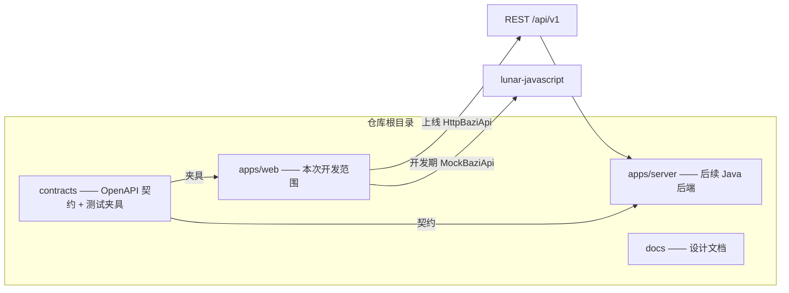

# 八字排盘 App · 前端技术设计文档（概要设计）

| 项目 | 内容 |
|---|---|
| 文档版本 | v0.1（开发前基线） |
| 日期 | 2026-08-08 |
| 适用范围 | 前端（apps/web）开发 |
| 关联文档 | [产品图文档](/Users/lijialin/Documents/Codex/2026-08-07/wo/outputs/bazi-app-mockups.md)、[PRD](/Users/lijialin/Documents/Codex/2026-08-07/wo/outputs/bazi-fengshui-app-PRD.md)、[设计哲学](/Users/lijialin/Documents/Codex/2026-08-07/wo/outputs/design-philosophy.md) |

---

## 1. 背景与目标

- 产品形态：Web 起步的八字排盘 App，后续可迁移微信小程序；前后端分离。
- 当前阶段：**先做前端**，后端（Spring Boot + Java 17 + MyBatis-Plus + MySQL）后置。
- 前端目标：
  1. 基于已定稿的「朱墨星图」设计系统与 8 模块产品图，还原交互原型；
  2. **契约先行**：排盘数据层抽象为 `BaziApi` 接口，开发期用 Mock 实现（内部 lunar-javascript 真算），后端就绪后切换 HTTP 实现，页面零改动；
  3. 排盘正确性前置：建立测试夹具与单测基线。

## 2. 总体架构



要点：
- `apps/web` 是纯前端，不直接依赖后端运行；
- 排盘结果形状（`PaipanResult`）由 contracts 定义，Mock 与 Http 实现输出同一形状；
- 测试夹具（名人八字数据集）为语言无关 JSON，未来用于前后端一致性回归。

## 3. 技术选型

| 领域 | 选择 | 说明 |
|---|---|---|
| 构建 | Vite 8 + React 19 | 现有脚手架迁移 |
| 语言 | TypeScript（strict） | 全量开启严格模式 |
| 路由 | react-router（v7 library 模式） | 8 模块路由 + 底部导航显隐 |
| 服务端状态 | TanStack Query v5 | API 缓存/加载/重试，配合 BaziApi |
| 客户端状态 | zustand | 当前命盘、UI 偏好（真太阳时默认等） |
| 样式 | CSS Variables 令牌 + CSS Modules | 设计系统令牌来自产品图文档，禁用全局散写样式 |
| 表单 | 受控组件（暂不引入表单库） | MVP 表单简单；复杂后再加 react-hook-form |
| 测试 | Vitest + Testing Library | 排盘映射、核心组件 smoke |
| 排盘计算（仅开发期） | lunar-javascript | 封装在 MockBaziApi 内，禁止页面直接调用 |

## 4. 仓库布局（前端相关）

```
bazi-fengshui-app/
├─ apps/web/                    # 前端应用
│  ├─ index.html
│  ├─ vite.config.ts
│  ├─ package.json
│  └─ src/
│     ├─ main.tsx
│     ├─ app/                   # 路由、布局、底部导航
│     ├─ components/            # 通用设计系统组件
│     ├─ features/              # 领域模块（bazi/comp/daily/report...）
│     ├─ pages/                 # 8 个路由页面
│     ├─ services/              # BaziApi 接口 + Mock/Http 实现
│     ├─ lib/                   # 排盘映射、格式化、工具
│     ├─ hooks/                 # 通用 hooks
│     ├─ types/                 # 领域类型
│     ├─ styles/                # 令牌、reset、全局样式
│     ├─ mocks/                 # 开发期假数据
│     └─ tests/                 # 夹具导入与测试入口
├─ contracts/
│  ├─ openapi.yaml              # 后端契约草案（后续完善）
│  └─ fixtures/bazi-cases.json  # 名人八字测试数据集
├─ docs/
└─ README.md
```

## 5. 路由与导航

| 路径 | 页面 | 底部导航 | 来源（原型模块） |
|---|---|---|---|
| `/` | 首页 | 显示 | 首页 |
| `/input` | 排盘输入 | 显示 | 排盘输入 |
| `/chart` | 基本排盘 | 隐藏 | 基本排盘 |
| `/chart/pro` | 专业细盘 | 隐藏 | 专业细盘 |
| `/comp` | 八字合婚 | 隐藏 | 八字合婚 |
| `/daily` | 每日运势 | 隐藏 | 每日运势 |
| `/report` | 命书报告 | 隐藏 | 命书报告 |
| `/profile` | 我的 | 显示 | 我的 |

规则：只有顶层三页（首页/排盘/我的）显示底部导航；子页面提供返回键（`navigate(-1)`）。当前命盘数据存 zustand，子页面从 store 读取，未命中时跳回 `/input`。

## 6. 数据契约（排盘核心）

`contracts/openapi.yaml` 的 TypeScript 对应形状（前端以 `types/` 为准，后端以 OpenAPI 为准，两边由夹具保证一致）：

```ts
interface PaipanRequest {
  name?: string
  gender: 'male' | 'female'
  solarDateTime: string          // ISO，如 1995-10-08T14:30:00
  birthPlace?: string            // 用于真太阳时
  trueSolarTime: boolean
}

interface Pillar {
  label: 'year' | 'month' | 'day' | 'time'
  gan: string
  zhi: string
  shiShen: string                // 十神；日柱为 '日主'
  hideGan: { gan: string; wuxing: 'jin'|'mu'|'shui'|'huo'|'tu' }[]
  naYin: string
  diShi?: string                 // 十二长生
  xunKong?: string[]             // 旬空
  shenSha?: string[]             // 神煞（后端实现，前端展示）
}

interface DaYun {
  ageRange: string               // '31-41 岁'
  ganZhi: string
  yearRange: string              // '2025-2035'
  isCurrent: boolean
}

interface PaipanResult {
  solarText: string
  lunarText: string              // '一九九五年闰八月十四'
  shengXiao: string
  pillars: { year: Pillar; month: Pillar; day: Pillar; time: Pillar }
  wuXing: { jin: number; mu: number; shui: number; huo: number; tu: number }
  daYun: DaYun[]
  currentYearGanZhi?: string
}
```

`BaziApi` 接口与实现：

```ts
interface BaziApi {
  paipan(req: PaipanRequest): Promise<PaipanResult>
}

// 开发期：lunar-javascript 真算（唯一允许引用 lunar-javascript 的地方）
class MockBaziApi implements BaziApi {}
// 上线：fetch POST /api/v1/records（形状不变）
class HttpBaziApi implements BaziApi {}
```

由 `VITE_API_MODE=mock|http` 环境变量选择实现；默认 mock。

## 7. 设计系统落地

- 令牌：色板（paper/card/ink/red/gold/jade/五行五色）、圆角、间距、字号阶梯，全部取自产品图文档，写入 `styles/tokens.css`。
- 组件清单（第一批）：`Button`（主/次/三等宽组）、`Card`、`SegControl`、`Switch`、`TabBar`（3 项）、`TopBar`（对称三栏）、`BaziTable`（四柱表 + 释义弹出）、`Sheet`（底部释义笺纸）、`Toast`、`WuxingBar`、`DaYunList`。
- 交互规范：按压回弹（`:active scale .97`）、页签/分段切换、开关滑动、动效 < 300ms 且尊重 `prefers-reduced-motion`；居中文本若使用 `letter-spacing` 必须加等量 `text-indent` 抵消尾部空隙。

## 8. 页面开发顺序

| 轮次 | 内容 | 验收 |
|---|---|---|
| M0.5（本轮） | 迁移 monorepo；路由+布局；设计系统组件；排盘输入页；基本排盘页（BaziTable+五行+释义）；Vitest 基线 | 输入生日 → 出真实四柱；构建绿；单测绿 |
| M0.8 | 专业细盘（大运/流年/十神页签）；首页完整化（今日宜忌/快捷入口/最近排盘） | 原型 v2 对应交互可用 |
| M1 | 每日运势；合婚（Mock 规则）；命书（PDF 占位）；我的 | 8 模块全部可走通 |
| M1.5 | 后端联调：HttpBaziApi 切换、OpenAPI 对齐、夹具一致性回归 | 前后端结果一致 |

## 9. 测试与验证策略

- 单元：`lib/bazi-mapper`（lunar-javascript 输出 → `PaipanResult`）用夹具断言；边界用例：闰月、节气交界、子时、真太阳时开/关。
- 组件：排盘输入表单校验、BaziTable 渲染、底部导航显隐 smoke 测试。
- 构建：`npm run build` 保持通过（tsc 严格模式 + vite build）。
- 走查：开发环境沙箱无法启动浏览器，交互效果由用户在 `npm run dev` 确认；后续可接入 `webapp-testing` 技能做 Playwright 回归（需沙箱外运行）。

## 10. 风险与决策记录

- 排盘方案：产品决策为后端 Java（lunar-java）出盘；前端开发期用 lunar-javascript 真算模拟，**两实现一致性由 contracts/fixtures 回归保证**，不在页面层混用。
- 神煞、真太阳时、合婚规则：lunar-javascript 不含，Mock 阶段先返回占位/空数组，标注"示例"，待后端实现。
- 依赖与网络：npm 安装需走本地代理（127.0.0.1:7890），README 已记录。

## 11. 变更日志

- v0.1（2026-08-08）：建立前端技术设计基线，确定架构/目录/路由/契约/设计系统落地/测试策略。
