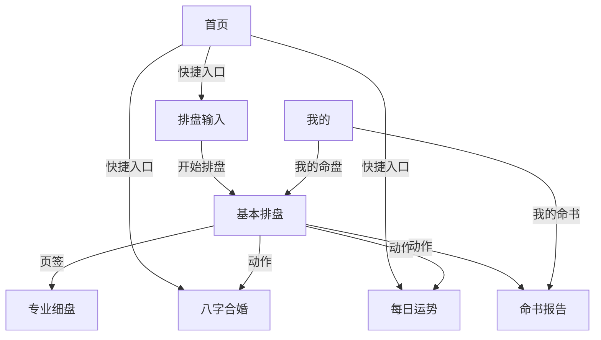

# 八字排盘 App · 产品图文档

| 项目 | 内容 |
|---|---|
| 文档版本 | v2.1（实现进度同步） |
| 更新日期 | 2026-08-08 |
| 状态 | 设计定稿；实现进度见前端技术设计文档 v0.2；示例数据为占位 |
| 设计语言 | 「朱墨星图」——宣纸底、松烟墨、朱砂点睛、描金为界（见设计哲学） |
| 参考对象 | 问真八字 App 的信息架构与排盘表版式（非品牌抄袭） |

---

## 1. 设计哲学

完整版见 [design-philosophy.md](/Users/lijialin/Documents/Codex/2026-08-07/wo/outputs/design-philosophy.md)，核心原则：

- 屏幕是一张星图，信息是星点，朱砂只点亮"此刻重要"之处（日主、当前大运、主行动）。
- 一切遵循八点网格与对称律动：成组按钮等宽、卡片边距一致、顶栏左右对称。
- 色盘不超过六色；字号阶梯三档；密处有据（四柱表）、疏处从容（命书封面）。
- 动效 < 300ms，尊重系统"减弱动态"；按压有回弹，切换如翻页。

## 2. 设计系统（令牌）

### 2.1 色板

| 令牌 | 色值 | 用途 |
|---|---|---|
| paper | `#f6f1e4` | 页面底（宣纸暖白） |
| card | `#fffcf4` | 卡片面 |
| ink | `#2f251c` | 主文字（松烟墨） |
| ink-2 | `#6f5d48` | 次级文字 |
| ink-3 | `#a08b6d` | 注释/占位 |
| red | `#b03a2e` | 主色（朱砂）：日主、当前大运、主按钮 |
| red-deep | `#98301f` | 主按钮渐变深端 |
| gold | `#b8904a` | 描金边界/强调 |
| jade | `#3f6f5c` | 吉、宜、生等正向提示 |
| line | `#e4d8bd` | 描边/分隔线 |

五行专用色（信息编码，不用于装饰）：

| 五行 | 色值 | 五行 | 色值 |
|---|---|---|---|
| 木 | `#3f8f5f` | 金 | `#b08d3e` |
| 水 | `#3d7ab5` | 火 | `#c8452c` |
| 土 | `#8a6d3f` | | |

### 2.2 字体与字号

| 角色 | 字体 | 说明 |
|---|---|---|
| 干支/大字 | Songti SC / STSong | 四柱干支、大运干支、封面上字 |
| UI 正文 | PingFang SC | 按钮、列表、说明 |
| 序号/印章字 | Kaiti SC（可选） | 学堂序号、印章点缀（v2 暂未用） |

字号阶梯：18-26px（展示）/ 13px（正文）/ 10-11px（注释），字距用于中文标题（顶栏 4px、按钮 2px），居中元素需加等量 `text-indent` 抵消尾部空隙。

### 2.3 几何与间距

- 圆角：卡片 16px、按钮 12px、图标按钮 12px、胶囊 999px、印章 3px/7px 异形。
- 间距：页面左右边距 14px；卡片间距 12px；按钮行距 10px；网格 gap 8px；一切为 8 的倍数或 14px 基准。
- 顶栏：`40px / 1fr / 40px` 三栏网格，图标按钮 36×36，严格对称。
- 底部导航：3 栏 flex 均分，每栏 `flex-direction: column; align-items: center`，图标盒 24×22 居中，标签与图标同轴。

### 2.4 组件规范

- 成组按钮（3 个）必须等宽：`grid-template-columns: repeat(3, 1fr)`；单一主按钮通栏（`.block`）。
- 主按钮：朱砂渐变 + 白字 + 投影；按压 `scale(.97)`。
- 分段控件：等宽网格，激活态朱砂底白字 + 轻投影。
- 开关：44×24 胶囊，激活态朱砂，圆点 `translateX(20px)` 滑动。
- 释义笺纸：底部滑出卡片（金边、米白底），点击四柱表内"十神/藏干/纳音/星运/神煞"弹出。
- Toast：底部居中深墨胶囊，1.6s 自动消失。

## 3. 信息架构

底部导航仅三项：**首页 / 排盘 / 我的**（学堂类目已移除）。子页面（排盘结果、细盘、合婚、运势、命书）通过返回键回到上一屏。

## 4. 模块与页面明细

| # | 模块 | 核心内容 | 关键交互 | 实现状态 |
|---|---|---|---|---|
| 1 | 首页 | 今日宜忌（今日/明日）、快捷功能 4 宫格、最近排盘 | 今日/明日切换、宫格跳转、底部导航 | ✅ M0.8 |
| 2 | 排盘输入 | 姓名、性别（乾/坤）、公历生日、出生时间、出生地、真太阳时开关 | 性别分段选择、开关、开始排盘 → 基本排盘 | ✅ M0.5 |
| 3 | 基本排盘 | 命主信息卡、四柱表（主星/天干/地支/藏干/纳音/星运/神煞）、五行占比、基本/专业页签 | 页签切换、表内点击弹释义笺纸 | ✅ M0.5（神煞行占位） |
| 4 | 专业细盘 | 大运列表（当前高亮）、流年解读、十神分布 | 大运/流年/十神/神煞页签切换 | ✅ M0.8（神煞占位） |
| 5 | 八字合婚 | 双方四柱并排、婚配指数、五行互补表、冲合分析 | 乙方排盘输入、生成合婚报告（占位 toast） | ✅ M0.8（示例规则） |
| 6 | 每日运势 | 当日干支、星级、宜忌、幸运色/方位/贵人、注意事项 | 今日/明日切换、分享（占位 toast） | ✅ M0.8（文案示例） |
| 7 | 命书报告 | 命书封面、目录（壹-伍）、样张预览、定价、导出 | 导出 PDF / 分享 / 返回 | ✅ M0.8（导出占位） |
| 8 | 我的 | 我的命盘、会员入口、我的命书、历史记录、设置（真太阳时/神煞开关） | 开关切换（持久化）、条目跳转 | ✅ M0.8（会员/历史占位） |

四柱示例数据（男·乾造）：1995-10-08 14:30 → 乙亥 乙酉 壬申 丁未；女·坤造：1996-03-18 10:00 → 丙子 辛卯 甲寅 己巳。

## 5. 当前设计决策记录

- 视觉方向采用**问真式信息密集型排盘表**（多行四柱表 + 五行彩色藏干 + 朱砂红/描金/宣纸底），弃用此前三套艺术方向稿。
- **学堂模块移除**，底部导航收敛为 3 项。
- 按钮统一对称：成组等宽、顶栏左右等宽、底部说明与按钮同边界。
- 图标与文字对齐：底部导航图标盒固定 24×22 flex 居中，三图标路径中心点已校准（日历 rect y=3）。
- 交互范围：页面切换、页签、分段、开关、释义笺纸、Toast、按压反馈。
- 合规：所有页面保留"仅供传统文化研究参考"声明；不做人工咨询/连麦；定价透明（命书 ¥9.9 为示例）。

## 6. 未决事项（待后续实现/评审）

- 神煞、流年解读、运势文案、PDF 导出待后端实现；合婚指数为前端示例规则（生肖六合 + 五行生克 + 互补）。
- 择日、分享、历史记录、会员开通为占位功能。
- 命书定价（¥9.9）、会员权益与定价待定。
- 微信小程序适配与合规过审策略（类目、文案词表）待专项评估。
- GitHub 仓库已同步（kalamdream0824-rgb/bazi-fengshui-app，私有）。

## 7. 文件索引

| 文件 | 路径 | 说明 |
|---|---|---|
| 交互原型 v2（最新） | `/Users/lijialin/.codex/visualizations/2026/08/07/019fdc97-ccf9-7903-a15d-2577e2b5a01b/bazi-app-v2.html` | 会话内渲染源；修改后需重新输出 `::codex-inline-vis{file="bazi-app-v2.html"}` |
| 原型副本（入库） | `/Users/lijialin/Documents/Codex/bazi-fengshui-app/docs/mockups/bazi-app-v2.html` | 项目仓库内稳定副本，随 git 版本管理 |
| 设计哲学 | `/Users/lijialin/Documents/Codex/2026-08-07/wo/outputs/design-philosophy.md` | 完整版哲学 |
| 产品设计文档 PRD | `/Users/lijialin/Documents/Codex/2026-08-07/wo/outputs/bazi-fengshui-app-PRD.md` | 需求/竞品/商业模式 |
| 本文档 | `/Users/lijialin/Documents/Codex/2026-08-07/wo/outputs/bazi-app-mockups.md` | 产品图总览与修改入口 |

> 早期静态逐屏图（`bazi-mockup-*.html`、`module-*.html`）已被 v2 交互原型取代，可删除或归档。

## 8. 修改指南（供后续 Codex 会话使用）

1. **改视觉/布局**：编辑原型 HTML（优先改入库副本，改完同步到会话可视化目录），保持 `#bz2` 作用域前缀与 2 节设计令牌一致；不引入新的视觉默认风格。
2. **改内容/数据**：四柱、神煞等一律以 lunar-javascript 输出为准，示例处标注"示例"。
3. **改结构**：新增/删除模块需同步更新本文档第 3、4 节与 PRD。
4. **验证**：HTML 需通过 lxml 解析；`<script>` 需通过 `node --check`；交互函数需保持无未定义标识符。
5. **交付**：在会话中重新输出 `::codex-inline-vis{file="bazi-app-v2.html"}`，并更新本文件"变更日志"。

## 9. 变更日志

- v2.0（2026-08-07）：按问真风格重构；移除学堂；按钮对称化；加入动态交互（导航/页签/开关/释义/Toast）；沉淀设计哲学与本文档。
- v2.1（2026-08-08）：同步实现进度——8 模块全部可走通（M0.5/M0.8），标注各模块实现状态与占位点。
